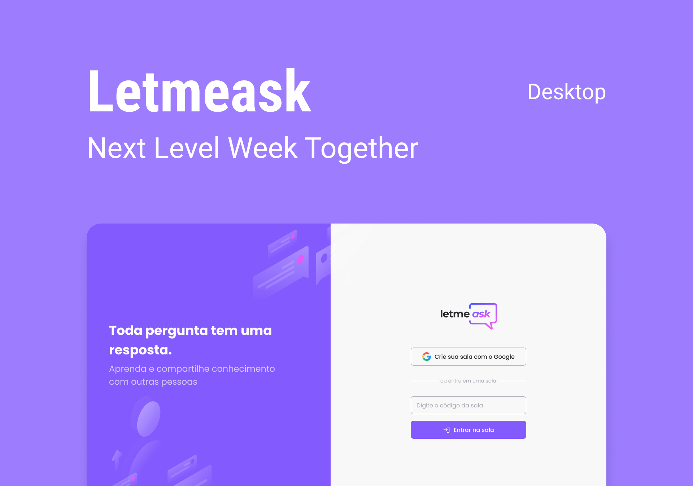

<!-- SHIELDS EXAMPLE [](https://github.com/samuel-mota/PROJECT-NAME/blob/main/LICENSE) -->

# 👋 Welcome to Let Me Ask Project
> 👋 *Bem Vindo ao Projeto Let Me Ask*


<p align="center">
    
</p>

## 🚀 About
> 🚀 *Sobre*

Project create in the NextLevelWeek Together, where you create rooms, send questions, give likes, login with google, etc... 

---

Projeto criado na semana NextLevelWeek Together, onde você por criar salas, enviar perguntas, dar likes, login com google, etc...

## 👁️ Preview
> 👁️ *Visualizar*

https://letmeask-4910d.web.app/

[](https://www.figma.com/file/ndFKrBDWUgVnnmJLbaGqo8/Letmeask)

## 🛠️ Technologies and Tools
> *Tecnologias e Ferramentas*


## 🏁 Getting Started
> *Iniciando o projeto*

1. Clone the project (*Faça o clone do projeto*)
2. Install dependencies (*Instale as dependências*)
	```bash
	$ yarn
	```
3. Run server (*Rode o server*)
	```bash
	$ yarn dev
	```
4. Open the browser at the address: (*Abra o navegador no endereço:*)
http://localhost:3000

### Deploying on Firebase
1. Create the build (*Crie a pasta build*)
```
yarn build
```

2. Deploy (*Implantar*)
```
firebase deploy
```

## ⚙️ Application Features
> ⚙️ *Funcionalidades da Aplicação*
	
- Google login by Firebase (*Google login pela Firebase*)
- Admin can create and delete rooms (*Admin pode criar e deletar salas*) 
- User can send, like and highlight questions (*Usuário pode enviar, dar like e marcar questões*) 
	
## 🔥 Tasks
> 🔥 *Tarefas*
	
- [ ] create toasts - https://react-hot-toast.com/
- [ ] create modals - https://github.com/reactjs/react-modal
- [ ] dark mode
- [ ] responsividade
- [ ] versão PWA - https://create-react-app.dev/docs/making-a-progressive-web-app/
- [ ] outros bancos de dados
- [ ] adicionar respostas feature
- [ ] redirecionar admin corretamente
- [ ] lista das salas e informar salas que voce é o admin
- [ ] styled components
	
## 🤝 Contributing
> 🤝 *Contribuições*
<details>
<summary>Click to expand (<em>Clique para expandir</em>)</summary>
Contributions, issues and feature requests are welcome! Follow these steps: (*Contribuições, problemas e solicitações de funcionalidades são bem-vindas! Siga os passos:*)

1. **Fork** this project (***Fork** este projeto*)
2. On your code editor terminal: (*No terminal do seu editor de código*)

	2.1. Create a branch with your feature: (*Crie uma branch para a nova funcionalidade:*)
	```bash
	$ git checkout -b feature
	```
	2.2. Commit your changes: (*Commit suas alterações:*)
	```bash
	$ git commit -am "add new feature"
	```
	2.3. Push your branch: (*Push sua branch:*)
	```bash
	$ git push origin my-feature
	```

3. Create a new **Pull Request** (*Crie uma nova **Pull Request***)
4. After your pull request is merged, you can safely **delete your branch**. (*Após seu pull request estiver com status merged, você pode **deletar sua branch** com segurança.*)
</details>

## 📝 License
> 📝 *Licença*

This project is under MIT license. (*Este projeto está sob a licença MIT*)

---

<p align="center">
⭐ If this project helped you in any way, consider contributing with starring.<br>
⭐ <em>(Se este projeto te ajudou de alguma forma, considere contribuir com uma estrela).</em><br>
Made with 💛 by Samuel Mota<br>
<em>(Feito com 💛 por Samuel Mota)
</p>
